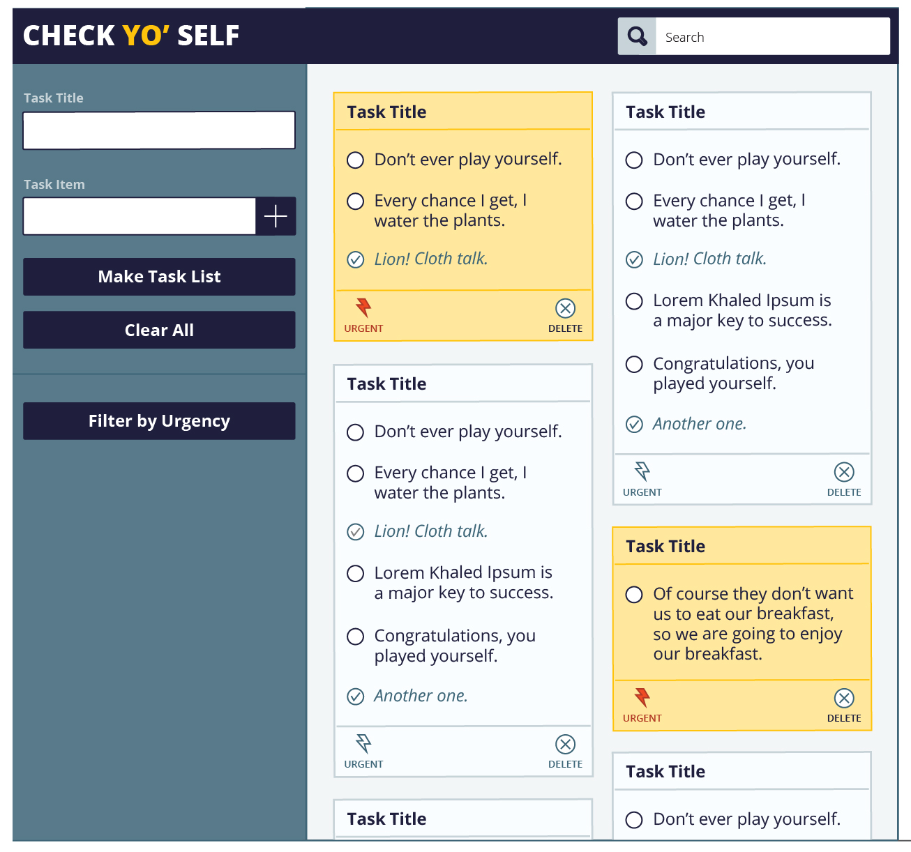
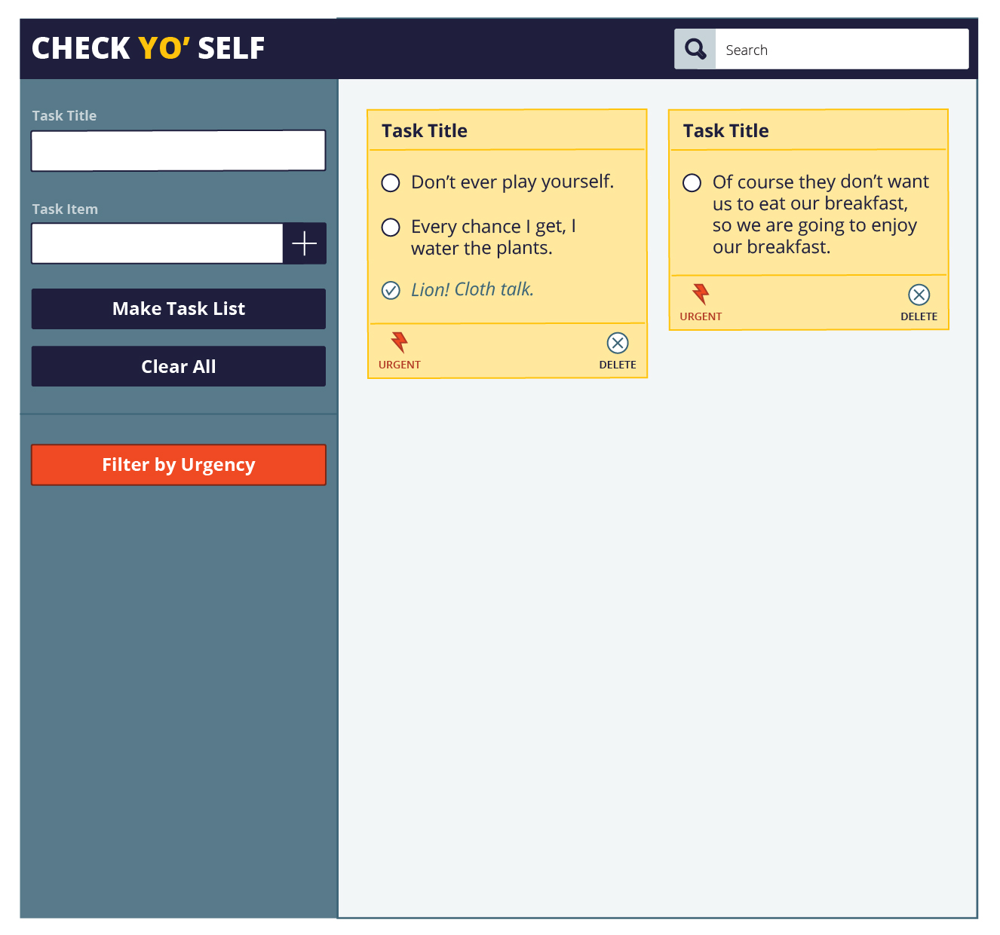

# Check Yo' Self

Below is the result of the Mod 1 1906 solo project at Turing School of Software and Design. Check Yo' Self is a checklist application that can make lists to be saved and remembered, checked off as completed, and deleted once complete.

Focuses of this project are to demonstrate understanding of semantic HTML, clean and organized CSS styles, DRY JavaScript, and localStorage persistence. Loops and array prototype methods are used to iterate through and filter DOM elements. Understanding the difference between the data model and how the data is displayed on the DOM is key and demonstrated in two JavaScript files used in the architecture of this project. The main.js file contains all DOM related JavaScript and the todo-list.js handles all data model JavaScript. Creating a great UX is also important as is matching and recreating the static UI provided.

I practiced an agile workflow by running two 3 day sprints. I also commit often and work in small steps and focused goals.

## Visuals

**Check Yo' Self Initial Static Comp Desktop:**

**Check Yo' Self Initial Static Comp Desktop Show New Task:**

**Check Yo' Self Initial Static Comp Desktop Show Urgency:**

**Check Yo' Self Initial Static Comp Mobile:**

**Check Yo' Self Final Comp Desktop:**

**Check Yo' Self Final Comp Mobile:**

## Link to GitPages
https://qfarenwald.github.io/check_yo_self/

## Contributions

Quinne Farenwald
